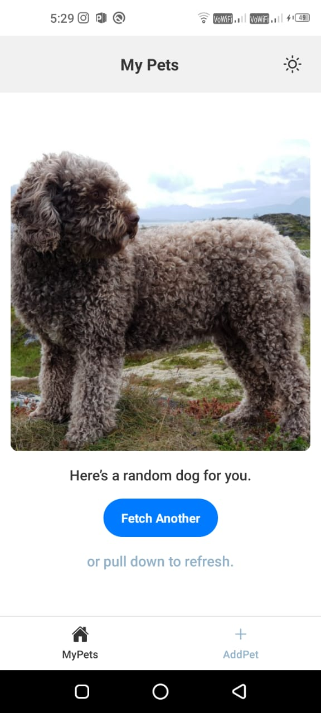
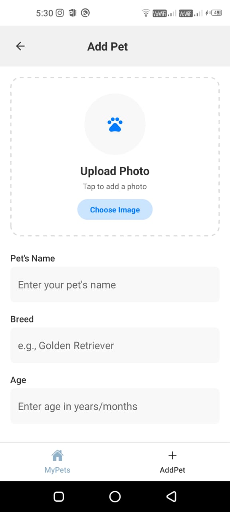
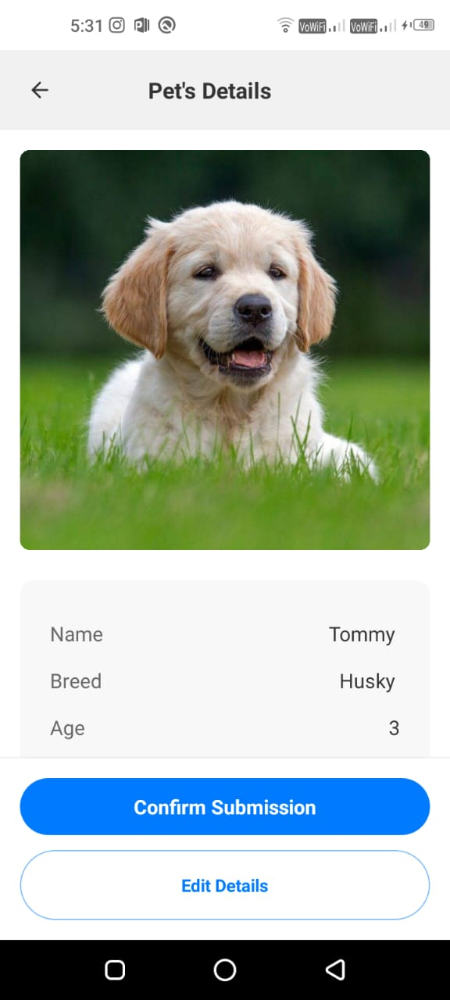
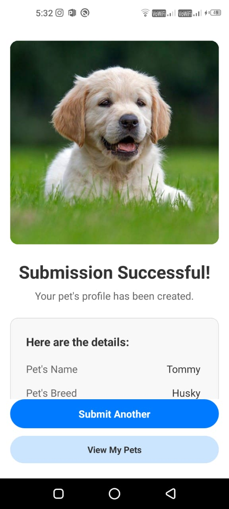

# 🐾 Pet Matcher – React Native App

A mobile app for adding and managing pets with a modern UI, dark/light theme support, and API integration.  
This app demonstrates clean architecture, reusable components, and seamless user flow.

---


## Screenshots

| Home Screen | Add Pet | Preview | Success Confirm |
|:------------:|:--------:|:------------:|:------------:|
|  |  |  |  |


---

## 🚀 How to Run the App

### 1️⃣ Clone the repository
```bash
git clone https://github.com/uk2459644/pet-matcher.git
cd pet-matcher
````

### 2️⃣ Install dependencies

```bash
npm install
# or
yarn install
```

### 3️⃣ Run on Android

Make sure an emulator or device is connected:

```bash
npm run android
```

### 4️⃣ Run on iOS (macOS only)

```bash
npm run ios
```

### 5️⃣ Start Metro Bundler (if not already)

```bash
npm start
```

---

## 💻 Platform Used

| Tool / Platform        | Purpose                                                |
| ---------------------- | ------------------------------------------------------ |
| **React Native (CLI)** | Core framework for building cross-platform mobile apps |
| **Android Studio**     | Android emulator and build environment                 |
| **Xcode**              | iOS simulator (if on macOS)                            |
| **VS Code**            | Development IDE                                        |
| **Webhook.site**       | Mock API endpoint for testing form submissions         |
| **Dog CEO API**        | Public API to fetch random dog images                  |

---

## 🏗️ Architecture Overview

The project follows a **modular and scalable architecture** used in professional React Native projects:

```
src/
├── components/        # Reusable UI components (Header, Buttons, etc.)
├── navigation/        # Navigation Setup (Stack, Tabs)

├── screens/           # Individual app screens (AddPet, Confirm, Success, MyPets)
├── theme/             # ThemeContext (light/dark mode + design tokens)
├── global/            # Global constants (Screen names, utilities)
├── utils/             # helper functions
└── App.js             # Entry point, Navigation setup
```

### **State Management**

* Local state via React hooks (`useState`, `useEffect`, `useContext`)
* Theme handled globally using `ThemeContext`

### **Navigation**

* Managed with **React Navigation (Stack Navigator)**
* App Flow:
  `MyPetsScreen → AddPetScreen → ConfirmPetScreen → SuccessScreen`

### **Data Flow**

* Form data submitted via **Webhook.site**
* API response determines navigation and state updates
* Random dog image fetched from **Dog CEO API**

---

## 🧩 Key Libraries

| Library                       | Purpose                                             |
| ----------------------------- | --------------------------------------------------- |
| **react-native-vector-icons** | Cross-platform icons                                |
| **@react-navigation/native**  | Navigation stack                                    |
| **@react-navigation/stack**   | Screen transitions                                  |
| **ThemeContext (custom)**     | Global theme system for colors, typography, spacing |
| **fetch API**                 | For network calls (Webhook.site + Dog API)          |

---

## 🎨 Design System

All styles are driven by a custom **ThemeProvider**, ensuring consistent design across screens.

* **Spacing scale:** `xs → xxxl`
* **Font sizes:** `xs → display`
* **Font weights:** `regular → extrabold`
* **Color palette:** light/dark themes
* **Border radius:** `sm → full`

This ensures pixel-perfect UI and effortless scalability.

---

## 🧠 Highlights

* 🌓 Adaptive Light/Dark theme
* 🐶 Random dog image via Dog CEO API
* 📱 Fully responsive layout with theme spacing
* ♻️ Reusable `Header` and `FloatingButton` components
* ⚡ Clean API handling with loading, error & success states
* 🔁 Smooth screen transitions

---

## 📸 App Flow

1️⃣ **MyPets Screen** – Displays random dog image
2️⃣ **AddPet Screen** – Add new pet details
3️⃣ **ConfirmPet Screen** – Review and confirm info
4️⃣ **Success Screen** – Confirmation with pet details

---

## 🧑‍💻 Author

**Upendra Kumar**
Frontend & React Native Developer
📧 [[uk2459644@gmail.com](uk2459644@gmail.com)]

---
"# pet-matcher" 
